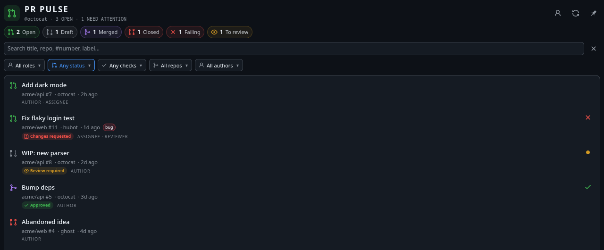
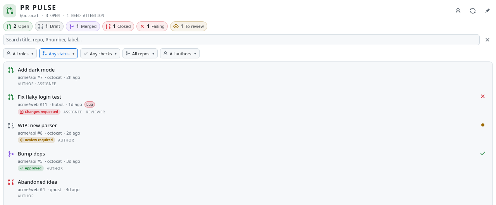

# PR Pulse

A native Plasma 6 widget for the GitHub pull requests that need you: the ones **assigned to you**, **opened by you**, or **awaiting your review**. PR Pulse talks to GitHub through the `gh` CLI you already use, so there are no tokens to paste and nothing leaves your machine except gh's own API calls.

   




## What it shows

- Every open and draft PR you authored, are assigned to, or are requested to review, plus recently merged or closed ones (last 7 days by default)
- GitHub's own Octicons and Primer colours, so status reads at a glance: open (green), draft (grey), merged (purple), closed (red)
- CI rollup per PR: ✓ passing, ✕ failing, ● running
- Review state tags: Approved, Changes requested, Review required
- Clickable summary chips for open, draft, merged, closed, failing CI, and review requests
- Filters for role, status, CI, repository, and author, plus free-text search over title, repo, `#number`, author, and labels. Filters persist across restarts.
- Click a PR to open it. Right-click to open its files or checks, or to narrow to its repo or author.
- Panel icon with a count badge for open PRs or PRs needing attention. The icon turns red when CI is failing.
- System, light, and dark themes. System follows your Plasma colour scheme and picks GitHub's light or dark status colours to match.
- Auto-refresh every 3 minutes by default, plus a pin to keep the taskbar popup open

## Requirements

- Plasma 6 with its Plasma5Support executable engine (installed with Plasma)
- Python 3.11+
- [GitHub CLI](https://cli.github.com/) authenticated once with `gh auth login`

## Install

Install `pr-pulse.plasmoid` from the [latest release](https://github.com/xiahongze/pr-pulse/releases) with Plasma's **Install New Widgets > Install from Local File**. Then search for **PR Pulse** in the widget picker and add it to a panel or the desktop.

From a checkout:

```bash
git clone https://github.com/xiahongze/pr-pulse.git
cd pr-pulse
./scripts/install.sh
```

## Finding `gh`

Plasma starts widgets with the session environment, which often lacks your shell's `PATH`. PR Pulse resolves `gh` in this order:

1. **gh executable** from widget settings (a file, or a directory containing `gh`)
2. `PATH`
3. Common locations: `/usr/bin`, `/usr/local/bin`, `/opt/homebrew/bin`, `/home/linuxbrew/.linuxbrew/bin`, `/snap/bin`, `~/.local/bin`, `~/bin`, `~/.nix-profile/bin`

If `gh` is missing or logged out, the widget explains what to do and links to its settings.

## How it works

On each refresh the widget runs its bundled standard-library Python collector. The collector makes **one** `gh api graphql` call with aliased searches (`assignee:@me`, `author:@me`, `review-requested:@me`, plus closed/merged history using `updated:>=`). It merges duplicates, records your role on each PR, and prints one JSON snapshot. Each search is capped at 50 results, and the footer shows `LIMITED` when GitHub has more. Filtering happens in the widget, so changing a filter never calls GitHub.

If GitHub is unreachable or rate limited, the last successful list stays visible under an error banner.

## Develop and package

```bash
make test      # collector unit tests against a fake gh
make lint      # compileall + qmllint
make package   # dist/pr-pulse.plasmoid
make install   # package and install/upgrade locally
```

## Uninstall

```bash
kpackagetool6 --type Plasma/Applet --remove io.github.xiahongze.prpulse
```

## Credits

Icons are [GitHub Octicons](https://github.com/primer/octicons) (MIT, see `contents/icons/octicons/LICENSE`). Status colours come from [Primer primitives](https://github.com/primer/primitives).
